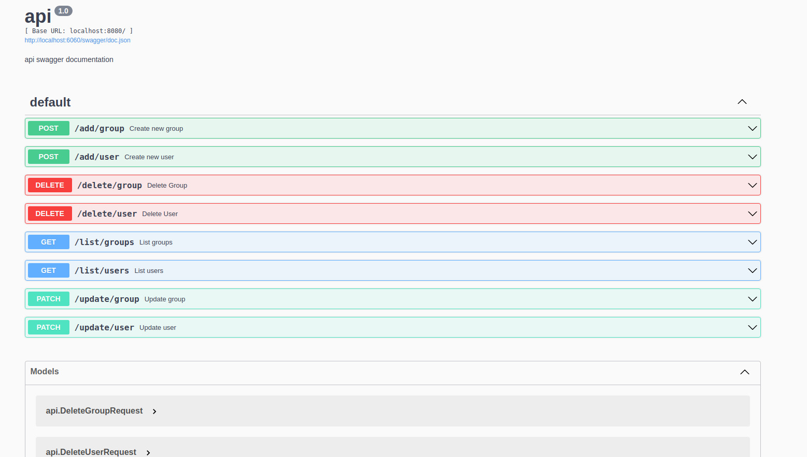

# api


## Quick Start

```console
$ export db_password=<password of the database>
$ docker-compose up --build -d
```

you can check swagger docs at http://localhost:6060/swagger/index.html#/



## unit testing

after running the containers using the docker-compose command run the following
command to test.

```console
$ export POSTGRES_USER=postgres
$ export POSTGRES_HOST=localhost
$ export POSTGRES_PASSWORD=<password of db that you have set on docker-compose>
$ export POSTGRES_DATABASE=postgres
$ go clean -testcache && go test -v ./api_testing/.
```

## Database

- `tables`

```sql
CREATE TABLE IF NOT EXISTS groups (
	id varchar primary key,
	name varchar not null
);

CREATE TABLE IF NOT EXISTS users (
	id varchar primary key,
	username varchar not null,
	password varchar not null,
	email varchar default '',
	group_id varchar default ''
);
```
